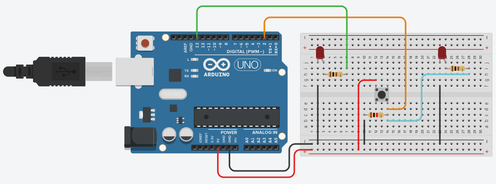
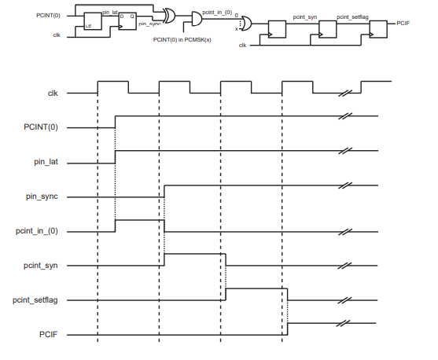

# ExtendUptime
This project implements a bare metal to extend a logic high using ATMEGA328p.

## Setup
The setup uses INT0 (pin 2 in Arduino UNO), a digital port which can be set to detect a rising edge and generate an interrupt as result. This interrupt the toggles an arbitrary output pin, which is set here to PORTB5 (pin 13 in Arduino UNO). Once the state of the output pin has been toggled, a timer is set to 2 Hz. Once the timer reaches its end, it will generate an interrupt that will reset the timer to stop interrupting itself and set to low the output pin's state. A setup to test this code can be found below.



You can test this setup @: https://www.tinkercad.com/things/3YCzbEGLNoQ-smashing-gogo-bruticus/editel?sharecode=QqdjqGblJZ84lZONKK-AdAIN6XaM14Qd_Lhm7XkvtmE

## About the timing
Below you can find an example of timing of a pin change interrupt that was extracted from the datasheet (p.79)


From the image we can conclude that it will take at most three clock cycles to begin the interruption associated to a rising edge in port INT0. Thus, we can expect a delay between said rising edge and the rise of output pin PORTB5 to be: (3*(1/clk_freq)+time_to_change_output_state)±(1/clk_freq), where *time_to_change_output_state* should be in the order of nanoseconds.

```
Note: For Arduino boards, the clock frequency (unless an external crystal is used) is of 16MHz.
```